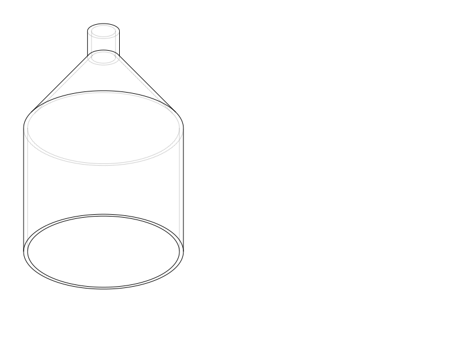

# Rangoli Printer Prototype

A personal mechanical prototyping project for dispensing coloured rangoli powder from image-derived colour data.

The CAD source of truth is **CadQuery Python**. Generated STEP/STL/SVG files are committed so the design can be inspected without running CadQuery.

## Current model — hopper shell V1



Current dimensions:

- Top outside diameter: **80 mm**
- Straight cylindrical section: **70 mm**
- Funnel section height: **40 mm**
- Outlet outside diameter: **16 mm**
- Outlet length: **15 mm**
- Wall thickness: **2 mm**
- Overall height: **125 mm**

## View it

- [Open the STL in GitHub's built-in 3D viewer](exports/rangoli_hopper_shell_v1.stl)
- [Open/download the STEP model](exports/rangoli_hopper_shell_v1.step)
- Enhanced interactive viewer: `https://bhadkamkar9snehil.github.io/HWThrowAway/` after GitHub Pages is enabled from **main / docs**.

The enhanced viewer supports orbit, pan, zoom, front/right/top/isometric views, wireframe, transparency, grid/axes, auto-rotate, part visibility, and part selection. It is already structured for multiple components later.

## Repository structure

```text
cad/
  hopper.py                         Parametric CadQuery source
exports/
  rangoli_hopper_shell_v1.step      Engineering CAD solid
  rangoli_hopper_shell_v1.stl       Printable / browser-viewable mesh
previews/
  rangoli_hopper_shell_v1.svg       Code-generated projection

docs/
  index.html                        Interactive Three.js viewer
  models.json                       Viewer part manifest

.agents/skills/
  mechanical-product-design/
    SKILL.md                         Mechanical design + assembly workflow

AGENTS.md                            Repo-wide instructions for coding agents
```

## Regenerate the model

```bash
pip install -r requirements.txt
python cad/hopper.py
```

The SVG is not an AI illustration. It is a geometric projection generated directly from the same CadQuery solid used for the STEP/STL outputs.

## Design rule

Keep the model parametric. Dimensions and mating/interface decisions belong in source code; STL is an output, not the editable source.
